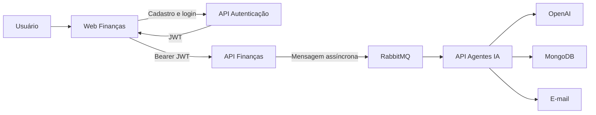

# 💰 Web Finanças


Frontend do ecossistema Web Finanças para cadastro de usuários, autenticação, gerenciamento de categorias e movimentações financeiras e solicitação de relatórios com inteligência artificial.

---

## 📌 Sobre o projeto

O **Web Finanças** é uma aplicação frontend desenvolvida com Angular para gerenciamento de finanças pessoais.

A aplicação integra-se a APIs REST desenvolvidas com Java e Spring Boot, oferecendo autenticação por JWT, isolamento dos dados por usuário e operações completas de cadastro, consulta, alteração e exclusão de categorias e movimentações.

O projeto faz parte de uma arquitetura composta por:

- `api-autenticacao`: cadastro, autenticação e emissão de tokens JWT;
- `api-financas`: gerenciamento das categorias, movimentações e solicitações de relatórios;
- `api-agentesia`: análise financeira com OpenAI, persistência do histórico e envio de relatórios por e-mail;
- `web-financas`: interface utilizada pelo usuário.

---

## ✨ Funcionalidades implementadas

### Autenticação

- Cadastro de usuários;
- autenticação com e-mail e senha;
- armazenamento da sessão no `sessionStorage`;
- envio automático do token JWT pelo interceptor;
- proteção das rotas privadas com `AuthGuard`;
- separação das URLs das APIs por ambiente.

### Categorias

- Cadastro de categorias;
- consulta das categorias do usuário autenticado;
- alteração de categoria;
- exclusão com modal de confirmação;
- bloqueio da exclusão de categorias utilizadas por movimentações;
- mensagens de sucesso, validação e conflito.

### Movimentações

- Cadastro de receitas e despesas;
- consulta por período;
- paginação e escolha da quantidade de itens;
- alteração de movimentações;
- exclusão com modal de confirmação;
- estados de carregamento, lista vazia, sucesso e erro;
- associação da movimentação a uma categoria;
- identificação visual entre receitas e despesas.

### Relatórios

- Seleção do período financeiro;
- solicitação assíncrona de relatório;
- integração com o processamento realizado pelas APIs;
- retorno visual sobre o envio da solicitação.

---

## 🛠️ Tecnologias utilizadas

- Angular 21.2;
- TypeScript 5.9;
- RxJS;
- Angular Router;
- Angular Reactive Forms;
- Angular HttpClient;
- Bootstrap 5.3;
- JWT;
- Vitest;
- HTML5;
- CSS3;
- APIs REST.

---

## 🏗️ Arquitetura da solução



O navegador comunica-se diretamente apenas com a API de autenticação e com a API de finanças. O processamento do relatório ocorre de forma assíncrona no backend.

---

## 🔐 Fluxo de autenticação

1. O usuário informa e-mail e senha;
2. a aplicação envia os dados para a `api-autenticacao`;
3. a API devolve os dados do usuário e o token JWT;
4. o frontend armazena a autenticação no `sessionStorage`;
5. o interceptor adiciona o cabeçalho `Authorization: Bearer <token>`;
6. o `AuthGuard` protege as páginas privadas.

O token não é colocado manualmente pelo usuário nas requisições do sistema.

---

## 📂 Estrutura principal

```text
src
├── app
│   ├── core
│   │   └── auth
│   │       ├── auth.guard.ts
│   │       ├── auth.interceptor.ts
│   │       ├── auth.models.ts
│   │       └── auth.service.ts
│   ├── autenticar-usuario
│   ├── criar-usuario
│   ├── dashboard
│   ├── categorias-cadastro
│   ├── categorias-consulta
│   ├── categorias-edicao
│   ├── movimentacoes-cadastro
│   ├── movimentacoes-consulta
│   ├── movimentacoes-edicao
│   ├── app.config.ts
│   └── app.routes.ts
├── environments
│   ├── environment.development.ts
│   └── environment.ts
├── index.html
├── main.ts
└── styles.css
```

---

## ⚙️ Configuração dos ambientes

### Desenvolvimento

O arquivo `src/environments/environment.development.ts` utiliza:

```typescript
export const environment = {
  production: false,
  apiAutenticacaoUrl: 'http://localhost:8082',
  apiFinancasUrl: 'http://localhost:8083'
};
```

### Produção

As URLs de produção devem ser configuradas em `src/environments/environment.ts` antes do deploy:

```typescript
export const environment = {
  production: true,
  apiAutenticacaoUrl: '',
  apiFinancasUrl: ''
};
```

Não coloque senhas, tokens JWT ou outras credenciais nesses arquivos.

---

## ▶️ Como executar

### Pré-requisitos

- Node.js compatível com Angular 21;
- npm;
- `api-autenticacao` executando na porta `8082`;
- `api-financas` executando na porta `8083`.

Para o processamento completo dos relatórios, também são necessários a `api-agentesia`, o RabbitMQ, o MongoDB e o serviço de e-mail configurado no ambiente de desenvolvimento.

### Instalação

Clone o repositório:

```bash
git clone https://github.com/beatrizlima-tech/web-financas.git
```

Acesse a pasta:

```bash
cd web-financas
```

Instale as dependências:

```bash
npm install
```

Execute a aplicação:

```bash
npm start
```

Acesse:

```text
http://localhost:4200
```

---

## ✅ Build e testes

Execute o build de produção:

```bash
npm run build
```

Os arquivos serão gerados em:

```text
dist/web-financas
```

Execute os testes sem modo de observação:

```bash
npm test -- --watch=false
```

Verifique vulnerabilidades das dependências utilizadas em produção:

```bash
npm audit --omit=dev
```

> Evite executar `npm audit fix --force` sem revisar as alterações, pois o comando pode instalar versões incompatíveis.

---

## 🛡️ Segurança

- Rotas privadas protegidas por `AuthGuard`;
- JWT enviado automaticamente pelo interceptor;
- sessão mantida apenas durante a aba do navegador com `sessionStorage`;
- APIs responsáveis pela validação efetiva das permissões;
- nenhuma credencial deve ser versionada no repositório;
- URLs separadas por ambiente.

A proteção do frontend melhora a experiência do usuário, mas a autorização verdadeira permanece obrigatoriamente no backend.

---

## 🚀 Próximas melhorias

- Detectar tokens expirados e redirecionar automaticamente ao login;
- implementar o fluxo “Esqueci minha senha”;
- sincronizar todas as validações entre frontend e backend;
- criar identidade visual própria para o Web Finanças;
- desenvolver indicadores de saldo, receitas e despesas;
- adicionar gráficos e movimentações recentes ao dashboard;
- centralizar as integrações em serviços Angular;
- ampliar os testes automatizados;
- implementar lazy loading das rotas;
- reduzir o tamanho do bundle inicial;
- revisar acessibilidade e responsividade;
- preparar os ambientes para publicação na AWS.

---

## 👩‍💻 Autora

**Beatriz Lima de Oliveira**

- [GitHub](https://github.com/beatrizlima-tech)
- [LinkedIn](https://www.linkedin.com/in/beatrizlima-tech)